********
Tutorial
********

TPPSc is a multi-page form that serves as the internal pipeline to submit scientific data to our database. This tutorial is meant to show users how to successfully use TPPSc to upload data to your database, along with how to specifically use certain features, and what to do depending on what type of study it is. 

Creating a New TPPSc Submission
===============================

Here you have the opportunity to create a new TPPSc Submission and the chance to continue working on any unfinished submissions. Simply use the dropdown to select your option and proceed to the next page.

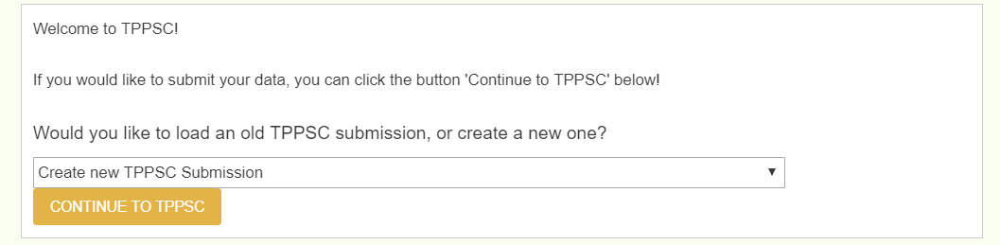

Author and Species Information (Page 1)
=======================================

This page requires you to enter a dryad DOI accession number of the study you plan on uploading. The dryad DOI should pull the species, authors, abstract, title, and journal of the paper. This allows the user to enter only one textfield to pull all relevant information. 

.. image:: ../../images/author_empty.png

Note, you do not enter the DOI, but the dryad DOI, and not the entire link, but only past the colon. If the full dryad DOI link was ``https://datadryad.org/resource/doi:10.5061/dryad.5jn04``, then only enter ``10.5061/dryad.5jn04``.

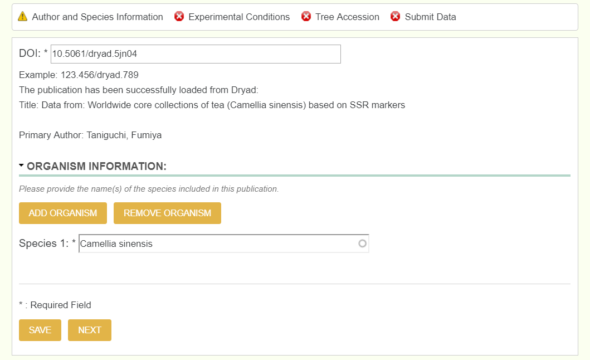

To check if it successfully pulled all relevant information, theres a green right hand bar that updates as you move throughout the form. Below is an example of how it should look once you move to the next page.

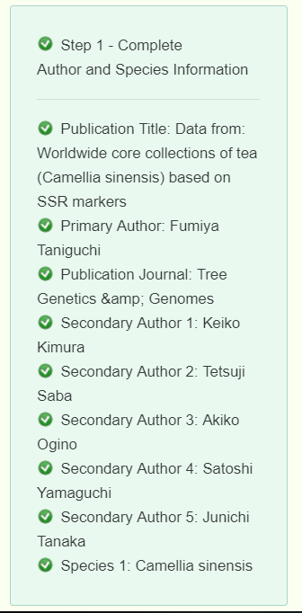

Experimental Conditions (Page 2)
================================

This page consists of two dropdowns that directly affects pages 3 and 4. The Data Type dropdown is where you chose what type of scientific data you are uploading, whether it be Genotype, Phenotype, Environment, or any combination of the 3. The Study Type dropdown is where you chose what kind of study you are uploading. The options for this field are Natural Population, Growth Chamber, Greenhouse, Experimental/Common Garden, and Plantation. The Data Type selection directly affects page 4 and the Study Type selection directly affects page 3.

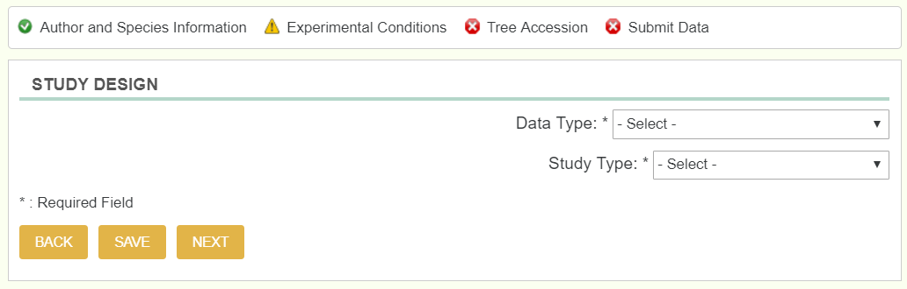

Tree Accession (Page 3)
=======================

This page is where we upload the tree location information. We do this by uploading an excel file that has all of the location information. Once the file is uploaded, you then select which columns represent which required data, where the required data is TreeID, Latitude, and Longitude (and if there are multiple species, then a column that represents the genus and species).  

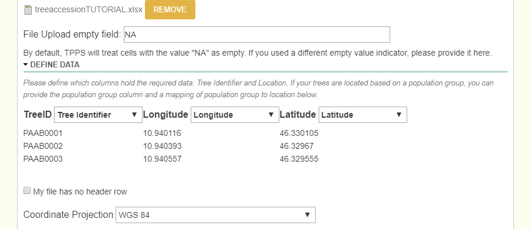

Below is an example tree location file:

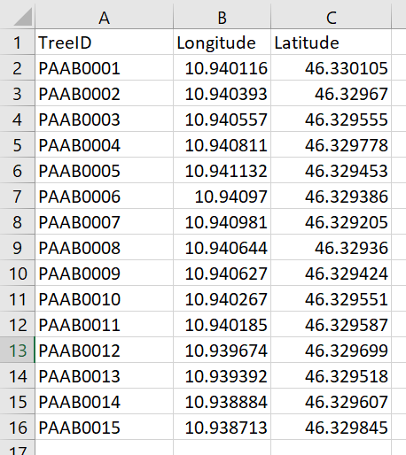

Genotype, Phenotype, and Environmental Data (Page 4)
====================================================

Page 4 will change depending on what you selected for the Data Type dropdown. If you selected an option with Genotype, then the Genotype fields will be available. The same goes for phenotype and Environment.

Genotype
--------

The main two types of genotypic data that TPPSc handles is SNP data, and SSR data. For both situations, there is a dropdown field that asks if a reference genome is used.

**SNP:** When dealing with a SNP study, first you select what kind of SNP's you have by selecting which kind of experimental design it is. The possible dropdowns for Experimental Design are GBS, Targeted Capture, Whole Genome Resequencing, RNA-Seq, and Genotyping Array.

 - IF GBS is selected, another dropdown for GBS Type appears with options RADSeq, ddRAD-Seq, NextRAD, and RAPTURE
 - IF Targeted Capture is selected, another dropdown for Targeted Capture Type appears with options of Exome Capture or Other

If there is SNP data to be uploaded along with the options above, then checking the SNPs Genotype Assay box will provide you with another excel sheet uploader identical to the Tree Accession, where you now select the columns for TreeID and SNP data. If there was an Assay Design file, there is now an option to upload that as well.

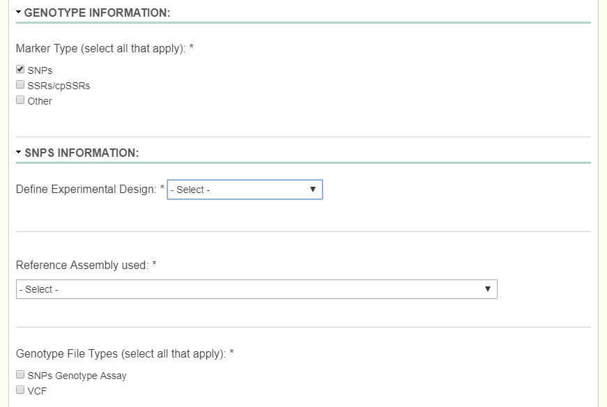

Below is an example SNP data file:

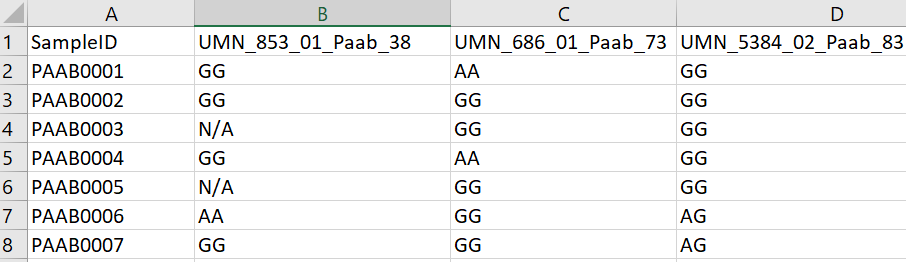

**SSR:** When dealing with an SSR study, first you describe what type of SSR/cpSSR you have by entering it into the textfield provided. Another field labeled Ploidy then appears which is very important when uploading the the SSR/cpSSR spreadsheet. Since SSR's would be different depending on which allele you are looking at, we need to add in a field to determine the ploidy to know which columns denote what. If an organism is diploid, then there would be two columns for each SSR. If an organism is triploid, then there would be three columns for each SSR.

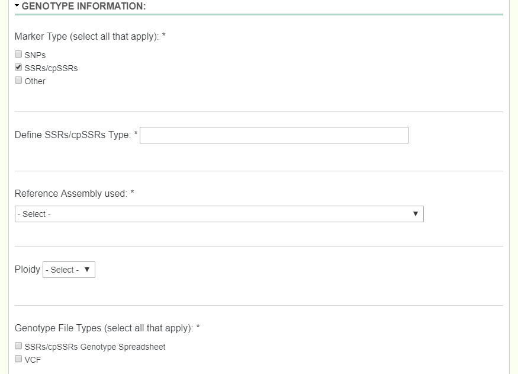

Below is an example SSR data file for 3 SSR markers where the ploidy would be diploid:

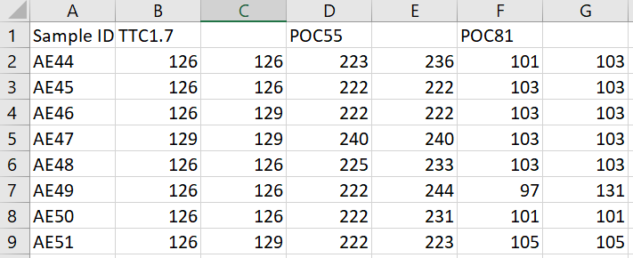

Phenotype
---------

When dealing with recorded phenotypes, we create phenotypes in tppsc, and then upload a phenotype file which uses corressponding phenotypes. Each phenotype has 4 different values: Name (human readable name, must match column name exactly), Attribute (thing the phenotype is describing: age, height, amount, etc), Description, and Units. Note, if a user has 20 + phenotypes, they can enter them all by creating an excel file with those 4 columns (name, attribute, description, and units).

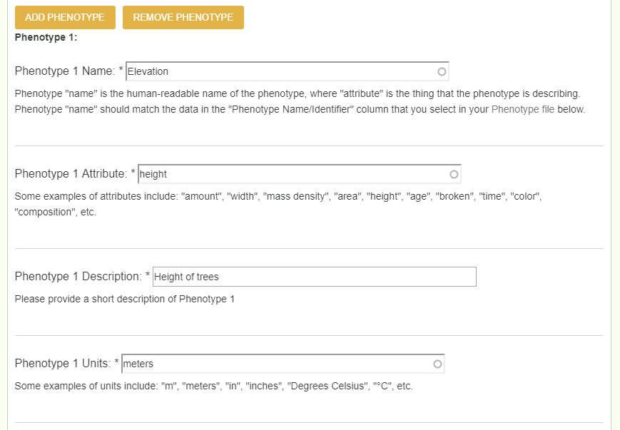

After creating each phenotype, you now need to upload the file. There are two types of file formats that the phenotype file can be in. File type 1 has all the phenotypes in their own columns, while file type 2 has 3 total columns: TreeID, phenotype, and value. Either are accepted, and once uploaded the user will need to chose which columns represent what, just as done previously.

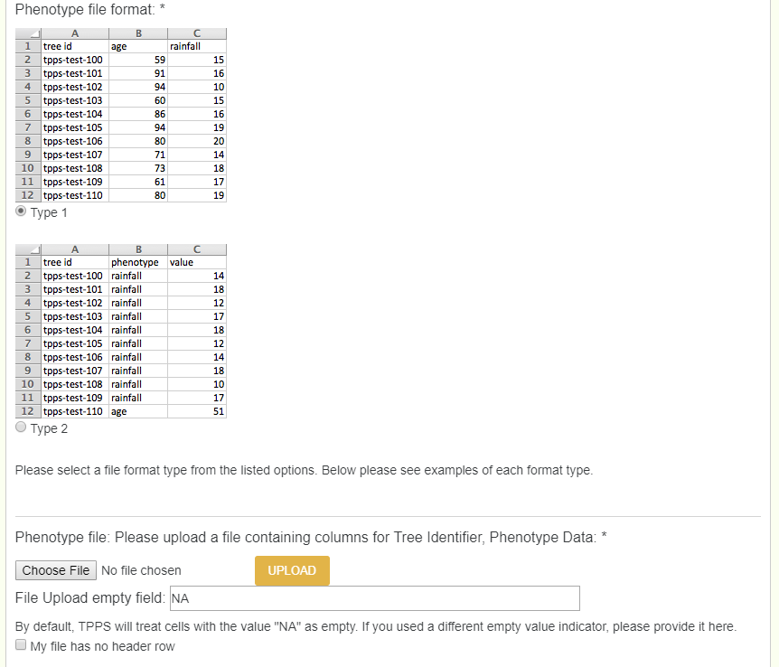

Environment
-----------

When dealing with environmental data, there are two types of data. You can use Environmental Layers indexed by CartograTree, and/or layers that you collected yourself. Indexed CartograTree layers vary by site, but common ones include Worldclim v.2, PET and Aridity, and Major Soil Types.

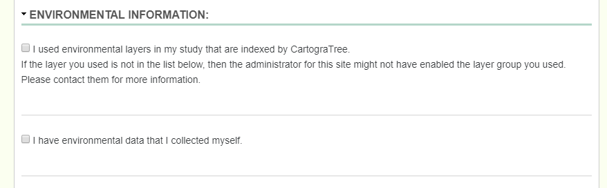

When adding layers that you collected yourself, one would follow the exact same process as adding in a phenotype (Name, description, units, and value).

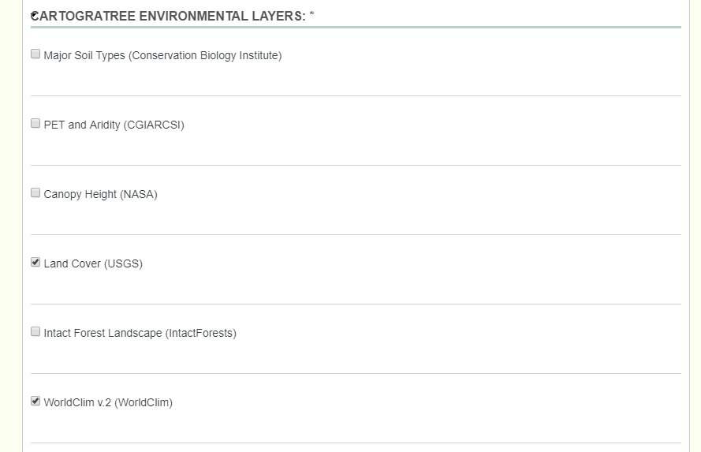

When selected from layers indexed previously, go through the process of checking what layers you specifically have.

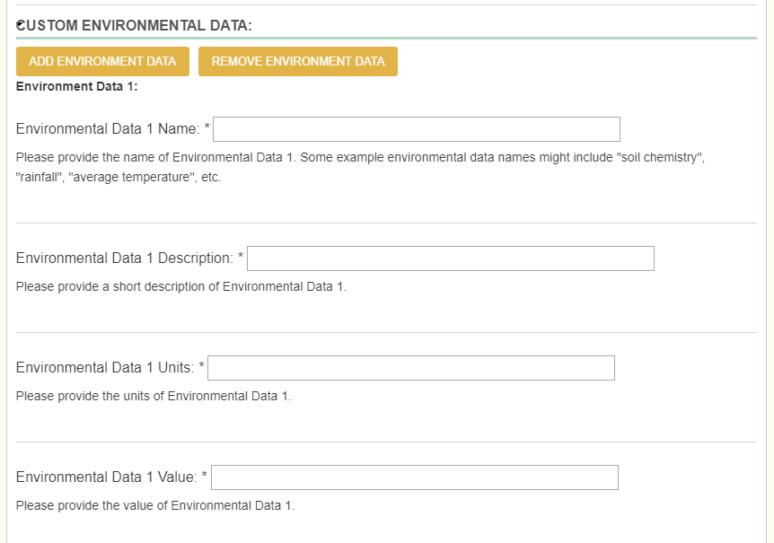
